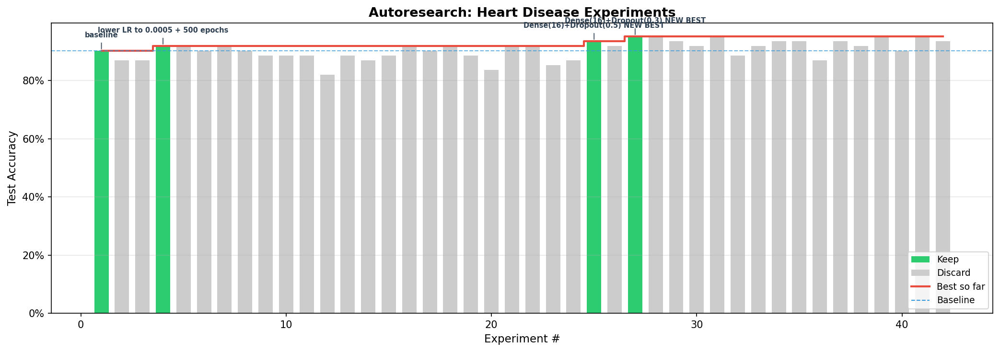

# Heart Disease Binary Classifier

Binary classification on the [UCI Heart Disease dataset](http://storage.googleapis.com/download.tensorflow.org/data/heart.csv) (303 samples, 13 features). Part of MIT 15.773 Hands-On Deep Learning (Spring 2024).

## Results

| | Accuracy | Architecture |
|---|---|---|
| **Baseline** | 90.16% | Dense(8, relu) → Dense(1, sigmoid) |
| **Best** | **95.08%** | Dense(16, relu) → Dropout(0.3) → Dense(1, sigmoid) |

**44 experiments** were run to reach the best result.



## Dataset

- **Samples**: 303 (242 train / 61 test, 80/20 split, seed=41)
- **Features**: 13 raw → 21 after one-hot encoding categorical columns (sex, cp, fbs, restecg, exang, ca, thal)
- **Preprocessing**: Numerical features (age, trestbps, chol, thalach, oldpeak) standardized using training set statistics
- **Target**: Binary (heart disease present or not)

## Best model

```
Input(21) → Dense(16, relu) → Dropout(0.3) → Dense(1, sigmoid)
```

- **Optimizer**: Adam, learning rate 0.0005
- **Loss**: Binary crossentropy
- **Epochs**: 500, batch size 32, validation split 0.2
- **Parameters**: 497

## Key findings

**What improved accuracy:**
- Lowering learning rate from 0.001 to 0.0005 with more epochs (90.16% → 91.80%)
- Adding Dropout(0.5) with 16 hidden units (91.80% → 93.44%)
- Tuning dropout from 0.5 to 0.3 (93.44% → 95.08%)

**What didn't help:**
- Deeper architectures (two hidden layers consistently worse)
- Batch normalization (hurt performance)
- Different activations (tanh, swish, SELU — no improvement)
- L2 regularization, class weighting, different optimizers (SGD, AdamW)
- Feature engineering (pairwise interactions, normalizing one-hot columns)
- Learning rate scheduling (ReduceLROnPlateau)
- More epochs beyond 500 (same accuracy, slower)
