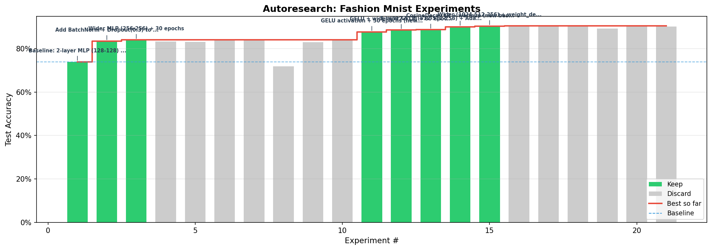

# Fashion-MNIST Image Classifier (MLP Only)

10-class image classification on [Fashion-MNIST](https://github.com/zalandoresearch/fashion-mnist) (70,000 grayscale images, 28x28). Part of MIT 15.773 Hands-On Deep Learning (Spring 2024).

## Results

| | Accuracy | Architecture |
|---|---|---|
| **Baseline** | 73.93% | Flatten → Dense(128) x2 → Dense(10) |
| **Best** | **90.34%** | Flatten → Dense(1024) → Dense(512) → Dense(256) → Dense(10) |

**20 experiments** were run (MLP only, no CNN).



## Dataset

- **Images**: 60,000 train / 10,000 test, 28x28 grayscale, normalized to [0, 1]
- **Classes**: T-shirt/top, Trouser, Pullover, Dress, Coat, Sandal, Shirt, Sneaker, Bag, Ankle boot
- **Validation**: 20% of training data

## Best model architecture

```
         ┌─────────────────────┐
         │   Input (28x28x1)   │
         └─────────┬───────────┘
                   │
         ┌─────────▼───────────┐
         │   Flatten (784)     │
         └─────────┬───────────┘
                   │
         ┌─────────▼───────────┐
         │  Dense(1024, GELU)  │
         │  BatchNorm          │
         │  Dropout(0.4)       │
         └─────────┬───────────┘
                   │
         ┌─────────▼───────────┐
         │  Dense(512, GELU)   │
         │  BatchNorm          │
         │  Dropout(0.3)       │
         └─────────┬───────────┘
                   │
         ┌─────────▼───────────┐
         │  Dense(256, GELU)   │
         │  BatchNorm          │
         │  Dropout(0.3)       │
         └─────────┬───────────┘
                   │
         ┌─────────▼───────────┐
         │ Dense(10, softmax)  │
         └─────────────────────┘
              1,469,706 params
```

- **Optimizer**: AdamW, cosine decay LR schedule (initial 1e-3, 3-epoch warmup), weight decay 5e-4
- **Loss**: Categorical crossentropy with label smoothing 0.1
- **Epochs**: 80, batch size 128

## Key findings

**What improved accuracy:**

- **BatchNorm + Dropout (73.93% → 83.43%)** — The biggest jump because the baseline had no regularization. The MLP easily memorized 60k training images but generalized poorly. BatchNorm stabilizes training by normalizing activations between layers, and Dropout forces the network to learn redundant, robust features instead of relying on any single neuron.

- **GELU activation (83.98% → 87.64%)** — ReLU hard-clips everything below zero (gradient is exactly 0 for negative inputs). GELU is a smooth approximation that lets small negative values through. For subtle class boundaries (shirt vs coat, pullover vs dress), GELU's smoothness gives the optimizer a smoother loss landscape to navigate — like carving with a scalpel instead of a chisel.

- **Wider layers (256 → 512 → 1024)** — An MLP has no spatial awareness — it sees a flat vector of 784 pixels. To compensate, it needs enough capacity to learn useful patterns purely through neuron combinations. Wider layers give the network more "slots" to represent different features (edges, textures, shapes) that a CNN would get for free from its spatial structure.

- **CosineDecay LR with warmup (88.68% → 90.05%)** — At the start, weights are random and gradients are noisy. Warmup starts with a small learning rate and ramps up, letting the network find a reasonable region before taking big steps. Cosine decay then takes big steps in the middle (exploring broadly) and tiny steps at the end (settling precisely into a minimum). A constant LR keeps bouncing around the minimum and never quite settles.

- **AdamW with weight decay + label smoothing** — Weight decay penalizes large weights, pushing toward simpler solutions. Label smoothing trains on soft targets (90% shirt, 1% each for the rest) instead of hard targets (100% shirt), preventing overconfidence — which matters because some Fashion-MNIST classes genuinely look similar (shirt/coat/pullover).

**What didn't help:**

- **Data augmentation** — Flips and crops actually *hurt* the MLP. Unlike a CNN, an MLP treats each pixel position independently, so a shifted image looks completely different to it. It can't learn spatial invariance.
- **MLP-Mixer with patch mixing** — Underperformed a simple wide MLP while being 3x slower. The dataset is too small and low-resolution to benefit from patch-based approaches.
- **Skip/residual connections** — Designed to help train very deep networks by allowing gradients to flow through shortcut paths. Our 3-layer MLP isn't deep enough to benefit.
- **SGD+momentum** — Adam's per-parameter adaptive learning rates outperformed SGD's single global rate for this task.
- **Very deep or very wide networks** — Going to 2048 neurons or 4+ layers gave marginal gains with 3x the parameters. The bottleneck is the MLP's lack of spatial structure, not capacity.
