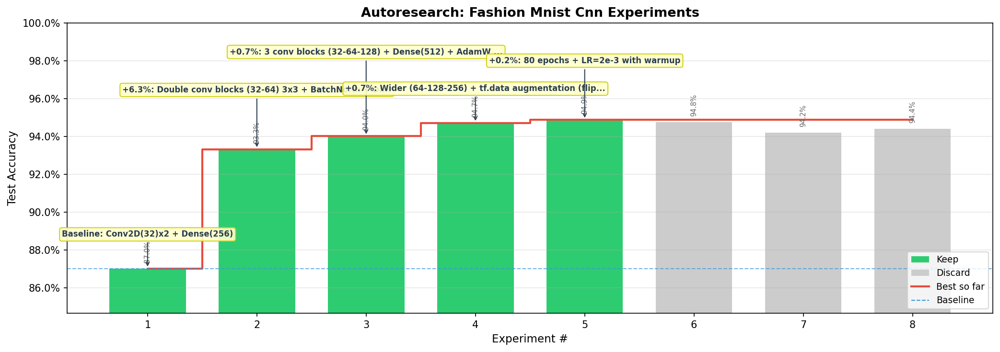

# Fashion-MNIST CNN Classifier

10-class image classification on [Fashion-MNIST](https://github.com/zalandoresearch/fashion-mnist) (70,000 grayscale images, 28x28). Part of MIT 15.773 Hands-On Deep Learning (Spring 2024).

## Results

| | Accuracy | Architecture |
|---|---|---|
| **Baseline** | 87.01% | Conv2D(32)x2 → MaxPool → Dense(256) → Dense(10) |
| **Best** | **94.87%** | 3 conv blocks (64-128-256) + Dense(512) + augmentation |

**8 experiments** were run.



## Dataset

- **Images**: 60,000 train / 10,000 test, 28x28 grayscale, normalized to [0, 1]
- **Classes**: T-shirt/top, Trouser, Pullover, Dress, Coat, Sandal, Shirt, Sneaker, Bag, Ankle boot
- **Validation**: 20% of training data

## Best model

```
Input(28, 28, 1)
Conv2D(64, 3x3, relu) + BatchNorm + Conv2D(64, 3x3, relu) + BatchNorm + MaxPool + Dropout(0.25)
Conv2D(128, 3x3, relu) + BatchNorm + Conv2D(128, 3x3, relu) + BatchNorm + MaxPool + Dropout(0.25)
Conv2D(256, 3x3, relu) + BatchNorm + Conv2D(256, 3x3, relu) + BatchNorm + MaxPool + Dropout(0.25)
Flatten → Dense(512, relu) + BatchNorm + Dropout(0.5)
Dense(10, softmax)
```

- **Optimizer**: AdamW, cosine decay LR schedule (initial 2e-3, 3-epoch warmup), weight decay 5e-4
- **Loss**: Categorical crossentropy with label smoothing 0.1
- **Augmentation**: Random horizontal flip + reflect pad (2px) + random crop
- **Epochs**: 80, batch size 128
- **Parameters**: 2,335,178

## Key findings

**What improved accuracy:**

- **Deeper/wider conv blocks with BatchNorm + Dropout (87.01% → 93.32%)** — The baseline had only 2 conv layers with 32 filters each. Scaling to 3 blocks (64-128-256) with paired convolutions gives the network enough capacity to learn hierarchical features: edges → textures → garment structures. BatchNorm stabilizes training at each layer, and per-block Dropout(0.25) prevents overfitting while keeping enough signal flowing.

- **AdamW with CosineDecay LR + warmup (93.32% → 94.01%)** — CosineDecay starts with a warmup phase (small LR while weights are random), then takes large steps to explore broadly, and gradually anneals to settle precisely into a minimum. AdamW's decoupled weight decay regularizes without interfering with the adaptive learning rates.

- **tf.data augmentation: flip + reflect pad + random crop (94.01% → 94.71%)** — Unlike the MLP project where augmentation hurt, CNNs are designed to be spatially aware. Horizontal flips teach left-right invariance (a shoe is a shoe facing either way). Reflect padding + random crop simulates slight translations without introducing black borders. This effectively multiplies the training set size.

- **More epochs with higher initial LR and warmup (94.71% → 94.87%)** — With augmentation generating new variations each epoch, the network benefits from more passes. A higher initial LR (2e-3 vs 1e-3) explores more aggressively during the cosine decay middle phase.

**What didn't help:**

- **GELU activation** — Achieved 94.76% (comparable) but was 18x slower on CPU than ReLU. CNNs apply activations millions of times per forward pass, so the smooth gradient benefit doesn't justify the cost. GELU helped the MLP project where the bottleneck was expressiveness, not here.
- **Stronger augmentation with brightness jitter** — Adding brightness variation introduced too much noise. Fashion-MNIST is grayscale with consistent lighting — jittering brightness changes the semantic content (dark vs light clothing).
- **Lower dropout + higher weight decay** — Reducing Dropout from 0.25 to 0.15 while increasing weight decay wasn't a good trade. Dropout's stochastic regularization is more effective for conv layers than the uniform penalty of weight decay.
