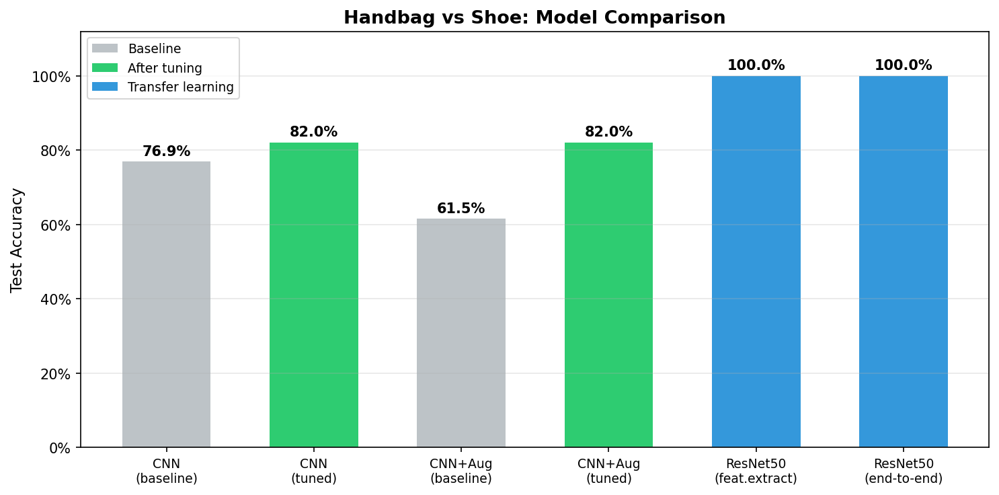

# Handbag vs Shoe Classifier

Binary image classifier comparing CNNs trained from scratch against ResNet50 transfer learning, based on MIT 15.773 Hands-On Deep Learning.

## Dataset

- **Source**: Custom handbags vs shoes dataset (Dropbox)
- **Images**: 224x224 RGB
- **Split**: 50 train / 25 validation / remaining test per class
- Auto-downloaded and split on first run

## Results



### CNN (`cnn`)

Rescaling(1/255) → 2x [Conv2D(32, 3x3) + MaxPool] → Dense(128, relu) → Dropout(0.5) → Dense(1, sigmoid)

| | Baseline | After tuning |
|--|----------|-------------|
| Test Accuracy | 76.92% | **82.05%** |
| Val Accuracy | 77.55% | 71.43% |
| Params | 101K | 12.5M |

**What helped:**
- **3x3 kernels (from 2x2)** — 2x2 kernels are too small to capture meaningful edge and texture features in 224x224 images. 3x3 is the standard minimum for learning directional edges and simple textures.
- **Adding Dense(128) hidden layer with Dropout(0.5)** — The baseline went straight from Flatten to the output neuron, giving the classifier no capacity to combine spatial features. The hidden layer lets the network learn non-linear feature combinations, and Dropout(0.5) is aggressive but necessary — with only 50 training images per class, the model memorizes instantly without it.

**What didn't help:**
- **More filters (64/128)** — Added capacity the tiny dataset can't support. More filters means more parameters to fit, and 50 images per class simply can't constrain them. Training accuracy hit 100% while test accuracy dropped.
- **3rd conv block** — Same problem: deeper networks need more data to generalize. The extra block just added more ways to memorize the training set.
- **BatchNorm** — With only ~3 images per batch per class, batch statistics are too noisy to be useful. BatchNorm needs reasonably sized batches to compute stable mean/variance.
- **L2 regularization, lower LR, more epochs** — L2 penalizes weight magnitude but doesn't address the core issue (too few samples). Lower LR just slowed convergence without improving the minimum. More epochs worsened overfitting.

### CNN + Augmentation (`cnn_augmented`)

RandomFlip + RandomRotation(0.05) + RandomZoom(0.1) → same CNN as above

| | Baseline | After tuning |
|--|----------|-------------|
| Test Accuracy | 61.54% | **82.05%** |
| Val Accuracy | 73.47% | 81.63% |
| Params | 101K | 12.5M |

**What helped:**
- **Same architecture improvements as CNN** — 3x3 kernels + Dense(128) + Dropout(0.5) applied here too.
- **Reducing augmentation intensity (0.1→0.05 rotation, 0.2→0.1 zoom)** — The original augmentation was too aggressive for this dataset. Handbags and shoes have distinctive shapes — rotating them 10% or zooming 20% can distort the shape cues the CNN relies on. Gentler augmentation adds useful variation without destroying discriminative features.
- **40 epochs (from 20)** — With augmentation generating different variations each epoch, the network sees effectively more unique images and benefits from additional passes.

**What didn't help:**
- **60 epochs** — Overfitting returned. Even with augmentation, 50 base images can only generate so much useful variation.
- **Lower LR** — The dataset is too small for fine-grained optimization to matter — the loss landscape is dominated by noise from the tiny sample size.
- **Flip-only augmentation** — Horizontal flips alone don't add enough variation. The combination of flip + rotation + zoom was needed to meaningfully expand the effective training set.

### ResNet50 Feature Extraction (`resnet50`)

Frozen ResNet50 pre-computes (7,7,2048) features once, then trains a small head: Dense(256) → Dropout(0.5) → Dense(1, sigmoid). Fast because features are cached.

| Metric | Value |
|--------|-------|
| Test Accuracy | **100%** |
| Val Accuracy | 100% |
| Params | 25.7M |
| Training Time | 15s |

### ResNet50 End-to-End (`resnet50_e2e`)

End-to-end model with augmentation layers → frozen ResNet50 → Dense head. Slower per epoch but enables fine-tuning by unfreezing backbone layers.

| Metric | Value |
|--------|-------|
| Test Accuracy | **100%** |
| Val Accuracy | 100% |
| Params | 49.3M |
| Training Time | 18s |

## Key takeaways

- **Transfer learning is the clear winner for small datasets.** Both ResNet50 variants achieve 100% accuracy effortlessly. ImageNet pre-training gives the model rich feature representations (edges, textures, shapes, objects) that transfer directly to handbag-vs-shoe classification. The 50 training images per class are more than enough to train a simple linear classifier on top of these powerful features.

- **Training CNNs from scratch on 50 images per class is fundamentally limited.** The best CNN achieved 82.05% — respectable but far from perfect. The core constraint is data volume, not model architecture. Every architectural improvement (more filters, deeper networks, BatchNorm) added parameters that the tiny dataset couldn't constrain, leading to worse generalization.

- **Data augmentation helps but can't fully compensate for small data.** Augmentation with gentle transforms (small rotation + zoom) brought the augmented CNN up to match the plain CNN at 82.05%. But aggressive augmentation (large rotation/zoom) actually hurt by distorting the shape features that distinguish handbags from shoes. Augmentation multiplies your data, but 10x of 50 images is still only 500 effective samples.

- **The overfitting pattern is consistent.** Across all CNN experiments, training accuracy hit 100% quickly while test accuracy plateaued in the 76-82% range. This gap couldn't be closed by regularization alone — it's a data limitation.

## Usage

```bash
uv run python training.py cnn
uv run python training.py cnn_augmented
uv run python training.py resnet50
uv run python training.py resnet50_e2e
```

## File structure

```
common.py          — Data download/split, dataset loading, plotting, metrics/logging
model_cnn.py       — build_cnn() and build_cnn_augmented()
model_resnet50.py  — Feature extraction + end-to-end ResNet50 builders
training.py        — Dispatcher: selects model, trains, evaluates, logs to results.csv
plot_models.py     — Generate model comparison chart
course.ipynb       — Original Colab notebook (unchanged)
```
