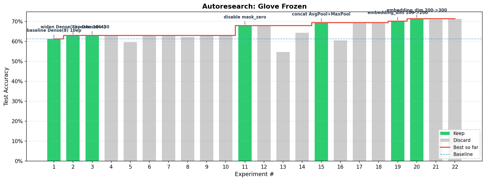
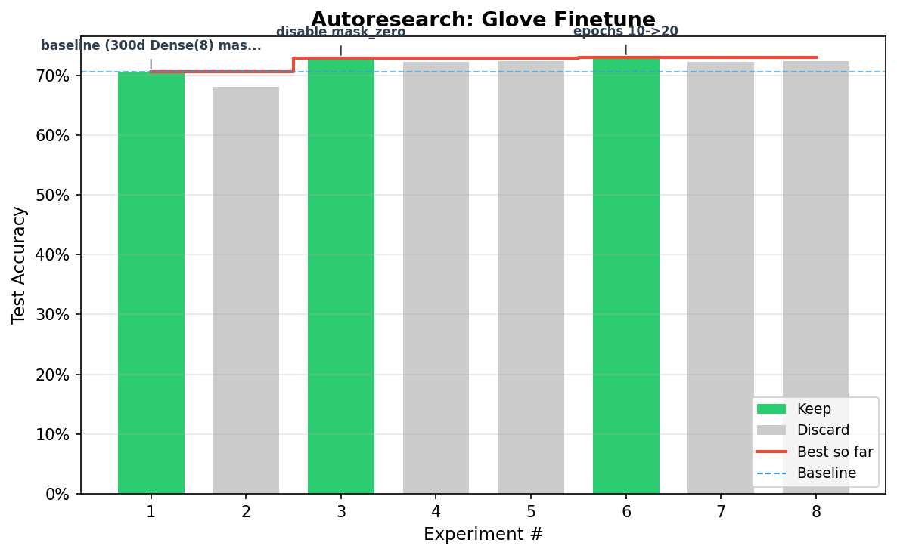
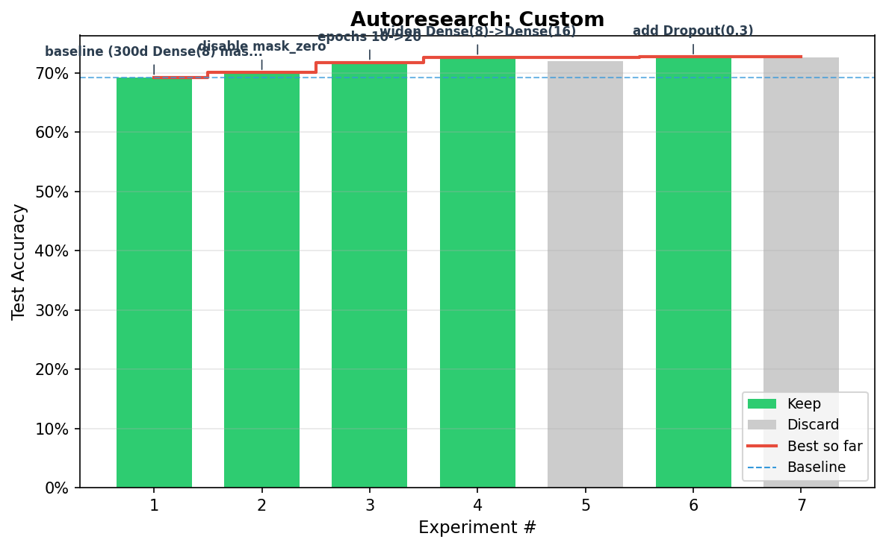

# Standalone Word Embeddings

Music genre classification from song lyrics using word embedding models. Compares pre-trained GloVe embeddings (frozen vs fine-tuned) against randomly initialized embeddings.

Based on MIT 15.773 Hands-On Deep Learning.

## Models

| Model | Embedding | Trainable | Description |
|-------|-----------|-----------|-------------|
| `glove_frozen` | GloVe 300d | No | Pre-trained embeddings held fixed during training |
| `glove_finetune` | GloVe 300d | Yes | Pre-trained embeddings updated during training |
| `custom` | Random init 300d | Yes | Embeddings learned from scratch |

## Results

| Model | Baseline | Best | Experiments |
|-------|----------|------|-------------|
| `glove_frozen` | 61.20% | **71.29%** | 22 |
| `glove_finetune` | 70.55% | **72.94%** | 8 |
| `custom` | 69.25% | **72.70%** | 7 |

### GloVe Frozen (22 experiments)



### GloVe Fine-tune (8 experiments)



### Custom Embedding (7 experiments)



## What worked

### Across all models
- **Disabling `mask_zero`** was the single most impactful change, improving every model. Without masking, `GlobalAveragePooling1D` averages over all positions including zero-padded ones, which implicitly encodes sequence length information into the pooled vector.
- **More epochs** (10 to 20-30) gave modest but consistent gains across models.

### Model-specific
- **GloVe Frozen:** benefited most from architectural changes since the embedding is fixed and all learning happens in the classifier head.
  - Concat `GlobalAveragePooling1D` + `GlobalMaxPooling1D` (+2% over avg-only) — captures both average semantics and strongest per-dimension signals
  - Wider Dense layer (8 to 64) — more classifier capacity to extract from frozen features
  - Larger GloVe dimensions (100d to 200d to 300d) — richer pre-trained representations, each step up improved accuracy
- **GloVe Fine-tune:** resistant to classifier changes since the trainable embedding absorbs the learning. Only `mask_zero` removal and more epochs helped. Wider Dense layers, concat pooling, dropout, and lower LR all hurt.
- **Custom:** similar pattern to fine-tune but benefited from a moderate Dense width increase (8 to 16) and light Dropout(0.3). Dense(32) was too wide and overfit.

## What didn't work

| Change | Models tried | Result |
|--------|-------------|--------|
| Deeper networks (adding Dense(32) layer) | frozen, frozen | Consistently worse, often catastrophic drops |
| BatchNormalization | frozen | Severely hurt performance (60% vs 68%) |
| Higher learning rate (3e-3) | frozen | Destabilized training |
| Lower learning rate (5e-4) | frozen, finetune | Marginal loss in both |
| Larger batch size (64) | frozen | Worse generalization |
| `GlobalMaxPooling1D` alone | frozen | Worse than average pooling (64% vs 68%) |
| `max_tokens` 10000 | frozen | No benefit over 5000 |
| `max_length` 150 or 500 | frozen | 300 was optimal |
| Concat pooling | finetune | Hurt when embeddings are trainable |
| Wider Dense (64) | finetune | Hurt — small classifier works better with trainable embeddings |
| Dropout | finetune | Hurt — model already regularized by embedding updates |

## Setup

GloVe embeddings must be downloaded to this directory:

```bash
wget http://nlp.stanford.edu/data/glove.6B.zip
unzip -q glove.6B.zip glove.6B.300d.txt
```

## Usage

```bash
uv run python training.py glove_frozen
uv run python training.py glove_finetune
uv run python training.py custom
```

## File structure

```
├── CLAUDE.md              # Autoresearch context
├── README.md              # This file
├── common.py              # Data loading, GloVe loading, metrics, logging
├── model_embedding.py     # Embedding model builders
├── training.py            # Dispatcher: selects model via CLI arg
├── embeddings.ipynb       # Original course notebook
├── results.csv            # Experiment log
└── experiments_*.png      # Per-model result charts
```
